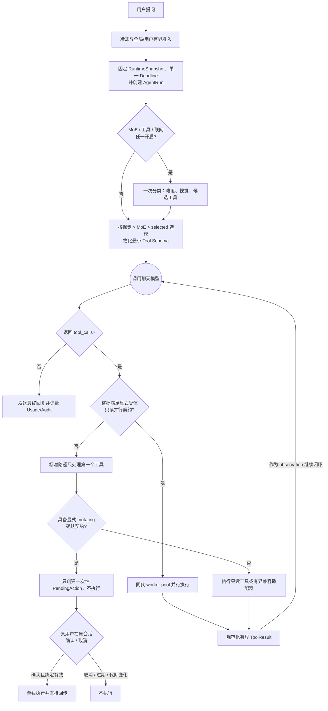

<div align="center"> <a href="https://v2.nonebot.dev/store"></a> <br> <p></p> </div><div align="center">

# nonebot-plugin-moellmchats

> 本项目现由 LoCCai 继续维护。感谢 Elflare 与历史贡献者完成原始设计；包名、
> LocalStore 配置目录和用户命令保持兼容。

✨ 混合专家模型调度LLM插件 | 混合调度·联网搜索·上下文优化·个性定制·Token节约·更加拟人 ✨

<a href="./LICENSE">  </a> </div>

- [🚀 核心特性](#-核心特性)
- [📦 安装](#-安装)
- [⚙️ 配置](#-配置)
- [🎮 使用](#-使用)
- [🔄 处理流程](#-处理流程)
- [更新日志](#更新日志)
- [鸣谢](#鸣谢)

## 🚀 核心特性

- **MoE架构（混合专家模型调度）**：动态路由至配置的 OpenAI Chat Completions 兼容模型；智能难度分级（简单/中等/复杂）自动匹配模型

- **智能网络搜索整合**：语义分析按需触发 Tavily 搜索；需要开启工具调用，并使用支持 Function Calling 的聊天模型

- **立体上下文管理**：群组/用户双层级隔离存储，按状态表实施滑动窗口、TTL 与 LRU 会话上限

- **个性化对话定制**：用户级性格预设，支持动态切换与自定义模板

- **有界稳定性设计**：全局最多 4 个活动 LLM 请求、32 个等待请求、每用户 1 活动 + 1 等待；冷却请求在排队前拒绝，180 秒总预算覆盖排队与执行；工具兼容投递单并发且队列有界

- **更加拟人的回复风格**：分段发送回复，每段根据内容长度增加延迟，支持自定义发送表情包

- **多模态视觉支持**：支持识别用户发送/引用的图片，以及工具调用中插件返回的图片（需配置视觉模型如GPT-4o）；有图片时强制调用视觉模型，纯文本任务自动回到普通模型以节省成本；历史记录自动回退为纯文本，大幅节省Token

- **完整紧凑目录 + 命中后展开（Function Calling）**：优先复用 PicMenu/QWeb 内存目录或 `PluginMetadata.extra.menu_data` 判断功能意图，只把命中插件的详细 Tool Schema 注入主模型；`resident_plugins` 仅作强制注入/诊断兜底，也支持原生 Python 工具与人工覆写

- **0.26.2 业务所有者与真实执行状态**：功能可声明有界 `llm_intents` 精确别名，唯一可用所有者纠正分类模型，重复/隐藏/黑名单/未加载均 fail closed；NoneBot 兼容调用只有在 Adapter 成功回调后才确认输出或副作用，并区分未命中、空命中、部分成功与结果不确定，避免“模型说做了”被误当成真实成功

- **固定 OneBot / NapCat 协议工具（0.26.0，默认关闭）**：离线收录 OneBot v11 38、v12 31、NapCat 4.18.19 175 项动作，按当前 Bot、用户、场景和人工策略过滤；模型只填写固定动作的严格 Schema，永久拒绝凭证、原始发包、生命周期和任意文件接口，不提供通用 `call_api`

- **分步 Agent 与二阶段确认**：标准路径每轮只执行一个工具，默认最多 6 步、同工具最多 2 次；Registered、Custom File 与 Generated Tool 中显式声明的变更型工具首次只生成一次性确认码，用户必须在同一会话另发 `确认执行 <确认码>` 才会执行，也可随时取消；只有程序化配置的受信只读批次才可能并行

- **运行快照热重载**：配置、模型、人设、回复、工具描述、自定义工具、MCP 与表情索引支持 2 秒低频检测和 `重载LLM`；候选先完整校验，再原子发布到当前进程，坏文件会继续沿用上一代快照

- **0.25 工具包热插拔**：超级管理员可让聊天模型生成工具草稿，由总结模型复核并分页核对 manifest、源码、测试、风险、capability、diff 与 SHA-256；批准时必须同时提交草稿 ID、至少 8 位内容哈希前缀和页面给出的完整 64 位 review stamp。`lifecycle_state.json` schema v3 以 revision/state digest CAS 管理唯一活动版本，并兼容读取 schema v2；版本按完整哈希只读保存，可无重启停用或回滚。生成工具即使声明 `permission=user`，也会默认以 `superuser` 生效，只有超管对精确包哈希和工具做人工授权后才可向普通用户开放

- **Capability 受控的隔离 runner**：文件和生成工具不在 NoneBot 主进程执行，使用 nobody、环境变量白名单、资源上限、独立进程组和全局单并发。Capability 严格限定为五个布尔字段：`network`、`process`、`workspace`、`host_filesystem`、`secrets`；effective 值取申请与管理上限的交集。Generated Tool 的管理上限只开放私有 workspace；Custom File 只有静态字面量声明才能放宽能力。`secrets` 仍是预留字段，即使为 true 也不会注入宿主密钥。完整路径要求 Linux，隔离前提不足时 fail closed，详见[自定义工具文档](docs/custom-tools.md#runner-隔离边界与运行要求)

- **结构化预检与固定制品**：Custom File / Generated 候选 generation 会先经过输出 `ALLOW` / `DENY` / `CAPABILITY_REQUIRED` / `RISK` 的 AST Policy，再把源码、Schema 和安全契约固化为不可变 `ToolArtifact`；执行前复核 artifact digest，Generated Tool 还会复核 bundle digest，活动请求不会回读后来被修改的源文件

- **独立协议与 OS 隔离**：结果通过版本化 FD3 返回，stdout/stderr 只作有界日志；FD3 用来隔离意外 stdout 污染，并不认证恶意工具代码。runner 使用独立 PID/mount/IPC/UTS namespace 与固定 hostname，把根挂载递归设为只读，只在 `workspace=true` 时恢复私有 workspace bind mount 的写权限；`host_filesystem=false` 时再用 Landlock 收紧可读路径并拒绝 xattr 读取/枚举。禁网时拒绝全部新建 socket；仅开放 IP 网络但未开放宿主文件时仍拒绝 AF_UNIX/AF_VSOCK，受限 `socketpair` 只保留 AF_UNIX/STREAM；Linux keyring syscall 始终拒绝。它没有 cgroup，也不是容器或完整 syscall allowlist；`stat`/`readlink` 等路径元数据仍可能可见，Custom File 显式取得 `host_filesystem=true` 后仍可读取 DAC 允许的宿主文件

## 📦 安装

截至 2026-08-28，当前推荐进入隔离测试的 0.26.1 精确 Git 提交是 `5d7f7958e9535f97c7b977d5fbe0fb57d68352ba`。它继承全量 OneBot/NapCat 协议工具和工具生成模型 HTTP 400 兼容处理，并将冷却管理入口改为优先级 0 的全文固定 Matcher，可靠识别 `/设置LLM冷却 0`；push run [`33160123847`](https://github.com/LoCCai/nonebot-plugin-moellmchats/actions/runs/33160123847) 的 12 个 job 全部成功，且只有一个成功的 `release-gate`。PR #3 早已合并并固定在旧 head `348293c…`，所以该补丁提交没有 PR run，不能称为“双门禁提交”。`20cfe44…` 是会漏接该现场指令的 0.26.0 历史安装点，`79d2268…` 是 0.25.0 回退基线。详细状态见 [K 阶段实施状态](docs/规划/08-onebot-napcat-protocol-tools.md)；PyPI 和七七实际安装状态必须分别核对。

这表示候选制品可以进入**隔离测试**，不表示已部署或生产验证。Git 安装必须固定完整 SHA，不要依赖可移动分支头。完整的加载、验收、停止条件和回退步骤见[安装、升级与测试验收](docs/installation.md)。

### 项目使用 uv 时

在 nonebot2 项目的根目录下打开命令行，输入以下指令即可安装：

```bash
uv add "nonebot-plugin-moellmchats @ git+https://github.com/LoCCai/nonebot-plugin-moellmchats.git@5d7f7958e9535f97c7b977d5fbe0fb57d68352ba"
```

### 项目使用 pip/venv 时

在 nonebot2 项目的根目录下打开命令行，输入以下指令即可安装：

```bash
python -m pip install \
  "nonebot-plugin-moellmchats @ git+https://github.com/LoCCai/nonebot-plugin-moellmchats.git@5d7f7958e9535f97c7b977d5fbe0fb57d68352ba"
```


## ⚙️ 配置

### `.env` 配置

在 nonebot2 项目的`.env`文件中添加下表中的必填配置

|       配置项       | 必填 | 默认值 |                                          说明                                          |
| :----------------: | :--: | :----: | :------------------------------------------------------------------------------------: |
|     SUPERUSERS     |  是  |   无   |                    超级用户，NoneBot自带配置项，本插件要求此项必填                     |
|      NICKNAME      |  是  |   无   |                   机器人昵称，NoneBot自带配置项，本插件要求此项必填                    |
| LOCALSTORE_USE_CWD |  否  |   无   | 是否使用当前工作目录作为本地存储目录 |
|   COMMAND_START    |  否  |   /    |                           命令前缀                           |

例：

```.env
SUPERUSERS=["your qq"]
NICKNAME=["bot","机器人"]
LOCALSTORE_USE_CWD=True  # 可选
COMMAND_START=["/",""]   # 可选
```

### 本插件主要配置

配置文件统一放在 `nonebot_plugin_localstore.get_plugin_config_dir()` 目录（参照 [NoneBot Plugin LocalStore](https://github.com/nonebot/plugin-localstore)），**首次运行时自动生成**。

| 文件 | 维护方式 | 说明 | 修改后是否需重启 |
| :--: | :------: | ---- | :--------------: |
| `providers.toml` | 手动 | **核心**：服务商/API密钥/模型参数，支持四级参数继承 | 自动或 `重载LLM` |
| `config.json` | 手动 | 基础行为、队列、预算、热重载与兼容投递 | 自动或 `重载LLM` |
| `model_config.json` | 指令/手动 | MoE调度、视觉/工具开关，支持指令实时切换 | 指令实时；手动自动重载 |
| `temperaments.json` | 手动 | 性格预设的system prompt | 自动或 `重载LLM` |
| `custom_plugin_info.json` | 手动 | 自动菜单不足时，完整覆写 NoneBot 插件发现说明与依赖 | 自动、`刷新工具` 或 `重载LLM` |
| `custom_tools/` | 手动 | 原生Python函数，供LLM直接调用 | 自动、`刷新工具` 或 `重载LLM` |
| `generated_tools/lifecycle_state.json` | 系统/超管指令 | schema v3 canonical 生命周期、digest-bound evidence、活动版本与精确版本授权；兼容读取 v2 | 生命周期推进及批准、拒绝、授权、停用、回滚时提交 |
| `generated_tools/drafts/`、`versions/` | 系统/超管指令 | 草稿与按完整 SHA-256 保存的只读版本 | 由生命周期指令管理 |
| `generated_tools/active.json`、`permission_policy.json` | 系统兼容投影 | 供旧版本读取的单向投影，不再作为当前版本决策源 | 生命周期提交后尽力更新，可能标记 stale |

启动和重载时会收紧 LocalStore 配置树权限：归属当前进程的配置目录为 `0700`，配置、凭据、草稿和权限策略文件为 `0600`；已批准的不可变版本目录/文件保持 `0500` / `0400`。这套保护依赖 POSIX 的 UID、mode bit 与安全 `chmod(..., follow_symlinks=False)` 语义；当前不支持 Windows，平台不能提供这些保证时会 fail closed。受保护配置路径发现符号链接、非当前用户所有或非普通文件/目录时也会拒绝加载或写入，不会通过强制 `chmod` 绕过。文件/生成工具的完整隔离路径还要求 Linux。

**[→ 完整配置参考（含所有字段说明与示例）](docs/configuration.md)**

文档导航：[安装与验收](docs/installation.md) · [依赖与运行前提](docs/dependencies.md) · [调度链路与架构](docs/runtime-architecture.md) · [自定义工具开发](docs/custom-tools.md) · [NoneBot 插件与 ToolSpec 接入](docs/plugin-integration.md) · [故障排查](docs/troubleshooting.md) · [性格系统](docs/personality.md) · [完整指令表](docs/commands.md)

## 🎮 使用

### 指令表

|            指令             |    权限    |    范围     |        参数        |                                   说明                                    |
| :-------------------------: | :--------: | :---------: | :----------------: | :-----------------------------------------------------------------------: |
|    @Bot或以nickname开头     |     无     | 群聊；超管私聊需开启 |      对话内容      |                                 聊天对话                                  |
|          性格切换           |     无     |    群聊     |      性格名称      |                  发送`切换性格、切换人格、人格切换` 均可                  |
|          查看性格           |     无     |    群聊     |         无         |             输出全部性格预设；发送 `查看性格、查看人格` 均可              |
|             ai              |     无     | 群聊；超管私聊需开启 |      对话内容      |              若已开启和配置，快速调用纯ai助手。如 `ai 你好`               |
|          查看模型           | 超级管理员 | 私聊 / 群聊 | 搜索关键词（选填） |      列出可用模型，支持多关键词模糊搜索（如：`查看模型 openai 4o`）       |
|          查看配置           | 超级管理员 | 私聊 / 群聊 |         无         |               可视化展示当前大模型各项运行状态与绑定的模型                |
|          刷新模型           | 超级管理员 | 私聊 / 群聊 |         无         |               重新读取 TOML 并自动拉取各服务商最新模型列表                |
|           设置moe           | 超级管理员 | 私聊 / 群聊 |    0、1、开、关    |                         是否开启混合专家调度模式                          |
|          设置联网           | 超级管理员 | 私聊 / 群聊 |    0、1、开、关    |                    是否开启网络搜索，如：`设置联网 开`                    |
|          切换模型           | 超级管理员 | 私聊 / 群聊 |    模型名或编号    |                不使用moe时指定的默认模型，如：`切换模型 1`                |
|           切换moe           | 超级管理员 | 私聊 / 群聊 | 难度 模型名或编号  |         难度为0、1、2，如：`切换moe 0 dpsk-chat` 或 `切换moe 0 2`         |
|        设置视觉模型         | 超级管理员 | 私聊 / 群聊 |    模型名或编号    |                    设置视觉模型，如：`设置视觉模型 3`                     |
|        设置分类模型         | 超级管理员 | 私聊 / 群聊 |    模型名或编号    |                    设置分类模型，如：`设置分类模型 1`                     |
|        设置总结模型         | 超级管理员 | 私聊 / 群聊 |    模型名或编号    |                设置工具包复核等总结任务使用的模型                         |
|      设置工具/函数调用      | 超级管理员 | 私聊 / 群聊 |    0、1、开、关    |              控制是否开启函数调用机制，如：`设置工具调用 开`              |
|          刷新工具           | 超级管理员 | 私聊 / 群聊 |         无         | 原子热重载工具；成功显示新 generation 与分类计数，失败保留旧 generation |
|          重载LLM            | 超级管理员 | 私聊 / 群聊 |         无         | 原子重载全部运行资源；失败时保留上一代快照 |
|        查看LLM状态          | 超级管理员 | 私聊 / 群聊 |         无         | 查看队列、拒绝、缓存、工具、投递与最近重载状态 |
|          查看请求           | 超级管理员 | 私聊 / 群聊 |         无         | 查看正在处理的 LLM 请求及编号 |
|          停止请求           | 超级管理员 | 私聊 / 群聊 | 编号或 `all`（选填） | 终止指定、唯一或全部活动请求 |
|          确认执行           | 待确认操作发起者 | 原私聊 / 原群聊 | 6 位大写十六进制确认码 | 一次性确认并执行与用户、Bot、会话、generation 绑定的变更型工具 |
|          取消执行           | 待确认操作发起者 | 原私聊 / 原群聊 | 6 位大写十六进制确认码 | 取消未执行的二阶段操作 |
|       添加LLM功能          | 超级管理员 | 私聊 / 群聊 |      功能需求      | 生成、隔离测试并复核工具草稿，不会自动启用 |
|     查看LLM功能草稿        | 超级管理员 | 私聊 / 群聊 | `ID [section [page]]`（均选填） | 分页查看完整 summary、manifest、source、tests、risks、capabilities、diff 与生命周期标识 |
|       批准LLM功能          | 超级管理员 | 私聊 / 群聊 | ID、至少 8 位哈希、完整 64 位 review stamp | 按审阅页头给出的三参数命令批准；审阅后任一 lifecycle 变化都会使旧 stamp 失效 |
|       拒绝LLM功能          | 超级管理员 | 私聊 / 群聊 |      草稿 ID       | 标记拒绝并保留源码用于审计 |
|        LLM功能列表         | 超级管理员 | 私聊 / 群聊 |         无         | 查看活跃工具包和草稿状态 |
|      设置LLM功能权限       | 超级管理员 | 私聊 / 群聊 | 包 ID 至少 8 位哈希前缀 工具名 `user\|superuser` | 对当前精确版本授予或撤销普通用户执行权限；仅可放宽 manifest 已请求 `user` 的工具 |
|        停用LLM功能         | 超级管理员 | 私聊 / 群聊 |      工具包 ID     | 无需重启停用工具包 |
|        回滚LLM功能         | 超级管理员 | 私聊 / 群聊 | 工具包 ID 版本前缀 | 无需重启切回唯一匹配的历史版本 |
|         插件黑名单          | 超级管理员 | 私聊 / 群聊 |         无         |                     查看当前禁止大模型调用的插件列表                      |
|        添加插件黑名单        | 超级管理员 | 私聊 / 群聊 |      插件标识      |                   将插件加入黑名单，禁止大模型代为调用                    |
|        移除插件黑名单        | 超级管理员 | 私聊 / 群聊 |      插件标识      |                     从大模型调用黑名单中释放特定插件                      |
|          设置私聊           | 超级管理员 | 私聊 / 群聊 |    0、1、开、关    |                         是否开启超级管理员私聊bot                         |
|    重置我的 / 清空上下文    |     无     | 私聊 / 群聊 |         无         |          清空自己的上下文对话记忆及CD状态（群聊中需要@Bot触发）           |
|        重置全部对话         | 超级管理员 | 私聊 / 群聊 |         无         |        清空所有用户的个人上下文及所有群聊环境记忆（群聊中需@Bot）         |
|   查看常驻插件 / 常驻插件   | 超级管理员 | 私聊 / 群聊 |         无         |         查看当前无视分类模型、强制注入给大模型的常驻插件/函数列表         |
| 添加常驻插件 / 添加常驻函数 | 超级管理员 | 私聊 / 群聊 |   插件/函数标识    | 将指定插件或函数设为常驻，强制大模型加载（如：`添加常驻插件 web_search`） |
| 移除常驻插件 / 移除常驻函数 | 超级管理员 | 私聊 / 群聊 |   插件/函数标识    |                   从常驻插件列表中移除指定的插件或函数                    |
|    查看消耗 / 查询token     | 超级管理员 | 私聊 / 群聊 | 数量或范围（选填） | 查看API Token消耗记录。支持数量(如:`5`)、区间(如:`10-15`)、倒数(如:`-50`) |

Generated Tool 的管理命令统一交给 `RuntimeReloader` 执行三个有序阶段：先基于计划的 `after_state` 预构建候选，再以固定 `.lifecycle.lock` 和 revision/state digest CAS 持久化 canonical 状态，最后发布当前进程的 RuntimeSnapshot；Store 的内部 commit 入口不是生产调用 API。候选或 CAS 失败时不会发布；如果磁盘提交成功后本进程发布失败，canonical 新状态会保留并由 watcher 重试收敛，不会用旧映射覆盖可能更晚的 revision。目录 fsync 会有界重试 3 次；重试耗尽时即使 after-state 当前可见也保持 `uncertain`，只有目录 durability 已确认而后续回读不确定时，才允许按完整 revision/state digest 精确比对 before/after。`查看LLM状态` 会显示 desired/applied revision、digest、当前观察到的 converged 状态以及 legacy 投影错误；这不表示所有进程之间存在内存 ACID。

schema v3 中的 `DraftEvidence` 是 canonical、绑定草稿 digest 并纳入 lifecycle state digest 的结构化证据；metadata 里的 `lifecycle_evidence` 只是它的兼容投影，投影 stale 不会改变决策源。旧 `metadata.review` 仍只是 best-effort 摘要。完整审阅页上的 review stamp 同时绑定草稿 ID/digest、lifecycle revision/state digest 和同 bundle 当前 active digest；任何审阅后的 lifecycle 变化都必须重新查看草稿并复制新命令。回滚还会在同一 canonical snapshot 下校验版本唯一匹配、未 Archived、owner/no-follow、目录 `0500`、且仅含三个 `0400` 普通文件并与完整内容 digest 一致。

### 效果图

**冷却与队列**


**联网搜索**


**一个ai驯服另一个ai的实录**

> 橙色头像为本插件的bot，使用了qwq-32b模型。（注：为了防止上下文干扰，新版的快速AI助手不再有群聊上下文，只保留用户上下文）


**分段发送与表情包**


**连续工具调用**


**调用其他插件**


## 🔄 处理流程



**核心机制说明**

1. **冷却与准入**：每个用户拥有独立冷却计时器（`cd_seconds` 配置）；冷却中的请求会在进入队列前立即拒绝。超级管理员可用 `设置LLM冷却 <0～86400>` 直接热修改，`0` 表示关闭；该固定命令不经过 LLM。通过冷却检查后仍受全局及每用户有界队列限制

2. **容错重试机制**：`max_retry_times` 包含首次调用；默认 3 次尝试，在后两次尝试前分别等待 4 秒、8 秒，且始终受整任务时间预算约束

3. **混合调度流程**：开启 MoE、工具或联网时，一次分类请求同时判定难度、视觉需求和候选工具；开启 MoE 时按难度选模型，否则使用当前聊天模型

4. **Token消耗降低**：动态Schema注入，日常聊天不携带工具说明，仅在触发特定任务时按需加载对应插件的Schema

5. **安全权限合并**：Generated Tool 的五字段 capability 只是申请，实际权限取申请值和管理策略的交集；当前安全上限只开放私有 workspace，`network`、`process`、`host_filesystem`、`secrets` 不会因模型在 manifest 中声明 `true` 而被放开

6. **默认串行、显式并行**：标准安装未配置 Trusted Runner Pool 和只读 Tool Graph，所以每轮只执行第一个工具；只有程序化集成明确提供同代 allowlist、依赖图和 worker pool，且整批都是通过权限/信任校验的强类型只读工具时才并行

完整状态机、模型优先级、缓存、确认绑定和默认 Memory/可选后端边界见[调度链路与运行时架构](docs/runtime-architecture.md)。

## 更新日志

> **📢 完整历史更新日志请移步 [CHANGELOG.md](./CHANGELOG.md) 查看。**

## 鸣谢

- [Nonebot](https://nonebot.dev/) 项目所发布的高品质机器人框架
- [nonebot-plugin-template](https://github.com/A-kirami/nonebot-plugin-template) 所发布的插件模板
- [nonebot-plugin-llmchat](https://github.com/FuQuan233/nonebot-plugin-llmchat) 部分参考
- [nonebot-plugin-kawaii-robot](https://github.com/lgc-NB2Dev/nonebot-plugin-kawaii-robot) 参考戳一戳回应消息
- [deepseek-r1](https://deepseek.com/) 我和共同创作README
- 以及所有LLM开发者
