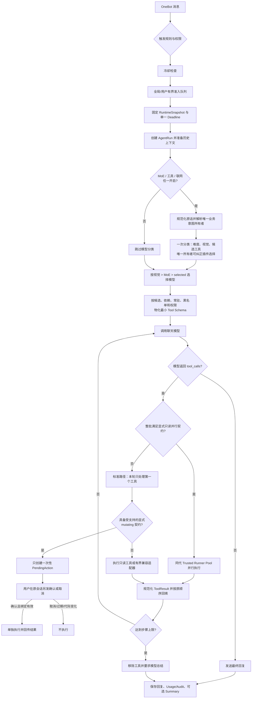

# 调度链路与运行时架构

这一页回答三个常见问题：一条消息到底经过什么链路、模型和工具怎样被选中、哪些高级组件默认并没有启用。

## 一条消息的完整链路



图中的“并行执行”不是默认行为。标准安装没有 `TrustedRunnerPool` 和 `ToolGraph`，因此仍按每轮一个工具串行闭环；只有程序化集成同时配置同代 allowlist、只读图和 worker pool，且整批调用通过所有检查时，才会并行。

## 逐段解释

### 1. 触发、冷却与准入

- 群聊中通过 @Bot、昵称开头或 `ai` 指令触发；私聊默认只允许超级管理员且需开启 `private_chat_enabled`。
- `cd_seconds` 在排队前检查。冷却中的请求直接拒绝，不占队列；超级管理员可通过优先级 0、全文锚定的固定 Matcher 执行 `/设置LLM冷却 <0～86400>` 热修改，`0` 表示关闭。该入口先于普通聊天处理，既不依赖标准命令前缀预处理，也不进入 LLM 冷却链路。
- 默认全局最多 4 个活动请求、32 个等待请求；每用户最多 2 个槽位，实际形成 1 个活动 + 1 个等待。
- `request_timeout_seconds` 在冷却/准入前建立，覆盖排队、分类、模型、工具和最终收尾，而不是每一步各拿一份新预算。
- 超时、管理员停止或异常会走 AgentRun 终态，并清理对应请求登记；不会因重试而获得新的总预算。
- 管理员停止会先释放该用户的冷却，再用最多 1 秒尝试发送取消通知，随后继续传播 `CancelledError`。通知失败或再次超时只记安全异常类型，不能把取消伪装成普通失败，也不能拖住请求清理。

### 2. 固定一代运行快照

每个通过准入的请求会固定当前 `RuntimeSnapshot`：

- `config.json`；
- provider/model 配置；
- 人设和互动回复；
- Tool Catalog、Schema、handler 与安全策略；
- 文件/生成工具的不可变 `ToolArtifact`；
- 对应 generation 的 cache、queue、repository 和 runner ports。

热重载先完整构建候选，再原子发布给新请求。已经开始的请求继续使用旧快照，不能在执行中途看到一半新配置，也不会重新读取后来被改过的工具源码。坏 JSON/TOML、工具名冲突、MCP 不可达或策略不合法时，候选不发布，上一代继续服务。

### 3. AgentRun、上下文与记忆

真实聊天入口用以下状态记录一轮任务：

```text
created → admitted → classifying → planning → executing
                                      ├→ waiting_confirmation
                                      └→ summarizing → completed
```

任一阶段也可进入 `failed`、`cancelled`、`timed_out` 或 `rejected`。模型、工具、视觉、确认、摘要和记忆分别形成 AgentStep；每个 ToolCall 记录来源、版本、状态和有界 preview。

上下文分成几类：

- 群聊环境记录：帮助模型理解最近群消息，受字符、token、条数、TTL 和 LRU 上限控制。
- 用户对话历史：按用户保留最近问答，默认 Memory。
- committed history / session summary / long-term memory：运行时接口已经接线，但只有显式组合相应 repository、summary generator 和 LTM service 后才真正使用持久化能力。
- LTM 和检索结果作为不可信 prompt data 注入，不能覆盖 system prompt。

标准安装没有 PostgreSQL、Redis、summary generator 或 LTM service，因此不要把“源码支持这些接口”理解成“开箱即用已经持久化”。

### 4. 分类与模型选择

当 `use_moe`、`use_web_search`、`use_tools` 任一为 true 时，系统做一次分类，输出：

- `difficulty`：`0` 简单、`1` 中等、`2` 复杂；
- `vision_required`：是否需要视觉模型；
- `required_plugins`：本轮候选工具。

实际模型优先级为：

1. 本轮确实包含图片，或分类认为需要视觉：使用 `vision_model`；
2. 纯文本且 `use_moe=true`：按 difficulty 使用 `moe_models.0/1/2`；
3. 其他情况：使用 `selected_model`。

分类模型有一个容易误解的兼容规则：只有 `use_moe=true` 时才使用 `category_model`；未开启 MoE、但因为工具或联网需要分类时，分类请求使用 `selected_model`。

工具候选还有一个先于分类结果的确定性所有者检查。功能目录可为一个功能声明最多 16 个 `llm_intents`；用户原话经过 NFKC、casefold、去空白和标点后做精确别名匹配。唯一、可见、未拉黑且已加载的所有者会纠正分类模型返回的插件；别名重复、所有者不可见、被拉黑或未加载时 fail closed，不会猜测另一个“意思相近”的插件。分类缓存策略为 v3，并绑定目录摘要、runtime generation、群/私聊场景和超级用户身份。

同一 generation 内，完整分类 key 相同的并发 miss 通过 `resolve_exact` 合并为一次共享构建；不同 key 仍可并行。单个等待者取消不会取消共享构建，构建失败会清理 flight 供后续重试，发布冲突会回读并验证精确胜出记录。缓存本身不可用时，系统保守降级为“中等难度、无分类工具”，但前面的唯一业务意图所有者仍可按确定性目录生效。

默认是固定模型模式。只有显式、完整配置 `capability_routing` 后，模型选择才会按 text/vision/tools/json_schema/reasoning/streaming 能力、上下文、输出、质量、延迟和成本约束重新路由。配置方法见[能力路由](./configuration.md#可选能力路由-capability_routing)。

### 5. 工具目录与最小 Schema

工具来源统一进入 generation-bound Provider Catalog：

| 来源 | 执行边界 | 典型用途 |
| --- | --- | --- |
| Builtin | 主进程；结果可能来自外网或当前 Bot | `web_search`、固定 OneBot/NapCat 协议工具 |
| Registered `ToolSpec` | 可信主进程 | 访问 Bot/Event 或应用服务的强类型工具 |
| Custom File | nobody 隔离 artifact；联网只能经 `safe_request` | 管理员手写、无需 Bot 对象的 Python 工具 |
| Generated Tool | 最严格的生成代码 sandbox | AI 生成、人工复核批准的工具包 |
| MCP | 外部进程或远端服务 | 标准 MCP server 提供的工具 |
| NoneBot plugin compatibility | 有界事件模拟 | 调用已有 Matcher/命令型插件 |

工具发现分三层，不能混为一份文档：

```text
PicMenu/QWeb/PluginMetadata 菜单
  → 有界 discovery hints：意图、别名、示例、条件提示
  → 唯一 llm_intents 所有者，或分类模型从完整紧凑目录选择插件标识
  → 只展开命中插件的 ToolSpec 或兼容 command Schema
  → handler / 定向 Matcher
  → OneBot V11 / NapCat V11 / OneBot V12 adapter
```

菜单只回答“用户可能想做什么”。`ToolSpec` 或兼容适配器回答“参数是什么、由谁执行、有什么副作用”；目标插件和 adapter 才执行真实动作。系统不会根据菜单自动生成任意 `bot.call_api`，也不会把 NapCat 的完整 API 面交给模型。

NoneBot 兼容插件的发现来源优先级为：显式 `custom_plugin_info.json` 覆写、PicMenu Next 已安装的内存目录、`PluginMetadata.extra.menu_data`、普通 Metadata。七七的 PicMenu 内存目录已经合并 QWeb Feature Catalog；通用插件不读取七七文件路径，也不依赖 PicMenu 包。每次候选构建只读取一次分离的 PicMenu 投影，并计算插件数、功能数和 SHA-256。即使启动时先发布了空 PicMenu generation，完整目录稍后安装也会在一个 watcher 周期内自动触发新 generation；摘要不变不重载，读取异常保留上一有效投影。

分类模型看到的是完整但有界的紧凑目录：普通强类型工具一工具一行；带菜单的兼容插件一功能一行，但每行第一列仍是同一个可执行插件标识。模型只返回这些标识，不返回菜单标题。主模型只接收“分类选中 + 依赖闭包 + `resident_plugins`”中的详细 Schema，并再次应用：

- `use_tools` 总开关；
- `use_web_search`；
- `tool_blacklist`；
- 普通用户/超级管理员权限；
- Provider/legacy parity；
- 当前 generation 与 cache key。

这就是“完整紧凑索引、命中后展开”：日常闲聊不用携带全部 Tool Schema，也不要求把业务插件常驻。`resident_plugins` 只是显式强制注入/诊断兜底。不同来源的工具名必须全局唯一；冲突会拒绝整代候选，不会按加载顺序静默覆盖。

菜单字段会清理展示标签与控制字符，拒绝错误类型，并限制每插件功能数、每功能触发数、字段长度和总字符数；PicMenu 隐藏功能既不进入普通用户分类目录，也不会在插件命中后的普通用户详细 Schema 中展开。它们与 plugin info、ToolSpec、`command_start` 和目录摘要一起固化到同代不可变快照；分类和 Schema 缓存共同防止空目录/完整目录、不同 generation、场景或权限交叉复用。兼容 `command` Schema 禁止额外字段，字符串长度为 1～1024；说明列出当前 generation 的首选及其他真实命令前缀，不要求模型猜 `<命令前缀>`。真实事件/定时功能只作发现提示，不能由合成 command 伪造。菜单可见性只是前置过滤，执行端仍必须复核真实权限。

协议工具在请求进入 Agent generation 后另外建立一次不可变能力快照。v11 调用 `get_version_info`，只有 `app_name=NapCat.Onebot` 才增加 NapCat 扩展；v12 调用 `get_supported_actions`，只取 Bot 声明支持与包内标准清单的交集。探测失败只让当前请求看不到协议工具，不会中止普通聊天。

协议短目录还会按普通用户/`SUPERUSER`、群聊/私聊、当前用户、当前群、当前消息和回复消息过滤。若用户原话命中已加载业务插件的规范化菜单触发词，默认先保留业务插件并抑制同意图协议动作。选中协议动作后才展开严格 Schema；handler 已在构造时固定 API 名，模型不能传入另一个 action。缓存身份还包含协议、实现/版本、支持动作摘要、Adapter、Bot、用户、消息和 runtime generation，禁止跨 Bot 或跨协议复用。完整规则见 [OneBot / NapCat 协议工具](./protocol-tools.md)。

### 6. 工具执行、确认和闭环

默认路径每轮最多真正执行一个工具。若模型一次返回多个调用，超出的调用会记录为跳过；模型拿到本轮 observation 后可在下一轮继续调用。总轮次取 `max_tool_rounds` 与 `max_agent_steps` 的较小值；同一工具使用同一组规范化参数还受 `max_repeated_tool_calls` 限制，不同参数不会被误判成原样循环。

Custom File 若声明有界 network allowlist，只能调用 worker 注入的 `safe_request`；直接使用 `aiohttp`、`httpx`、`requests`、`urllib` 或 `socket` 会在 AST 预检中拒绝。该门面每一跳都重新校验 allowlist 与全部 DNS 地址，只连接已经验证的公网 IP，关闭自动重定向并拒绝 URL 凭据、HTTPS 降级和跨域敏感头继承；最多 5 次重定向，所有跳共享固定时间与请求/响应大小预算。它是管理员工具的受控网络门面，不是对任意 Python 源码绝对安全的证明。

工具结果统一转换为 `ToolResult`：

- `text`、`images`；
- `files`、`structured`、`citations`、`metadata`；
- 全部字段做类型、大小、深度、数量和 locator/URL 边界检查；
- 发给模型的文本按工具 `result_limit` 或全局 `max_tool_result_chars` 截断；图片按 `max_tool_images` 截断。

Registered `ToolSpec`、Custom File 和 Generated Tool 中显式标为 `mutating` 的工具，第一次调用不会执行，而是创建绑定以下信息的一次性确认码：

- Bot/Adapter；
- 用户与群组/私聊会话；
- 工具名、参数 SHA-256；
- runtime generation；
- Generated bundle digest（如适用）。

用户必须另发 `确认执行 <确认码>`。过期、重放、换用户、换会话、重载后 generation 改变或工具版本改变都会拒绝。同步 `mutating` `ToolSpec` 因线程在 asyncio 超时后不可杀死，会在启动前拒绝；应使用可取消的 async handler 或隔离文件工具。

协议 Broker 使用独立但同样一次性的确认记录，额外绑定协议、实现/版本、支持动作摘要和人工策略摘要；确认前重新探测 Bot 能力。只有三个包内固定当前目标的低风险协议封装可以按配置在限额内免确认，Custom、Generated、MCP 和普通 Registered 工具不能声明这种绕过。协议副作用最多调用一次；响应不确定时返回 `result_unknown`、保留额度并禁止自动重试。

兼容的 NoneBot Matcher 插件和当前 MCP 配置无法表达同等精细的逐工具确认契约。NoneBot 兼容适配器会保守记录为 `mutating`，但当前为保留既有命令行为使用有界兼容执行；MCP 工具也没有逐工具 effect/permission 配置。两者都只应开放已经审查、原本就允许对应用户直接调用的能力。可能产生副作用的新能力应改写为 `ToolSpec(effect=ToolEffect.MUTATING, ...)`，详见[插件集成](./plugin-integration.md)。

NoneBot 兼容适配器不会再用“有 metadata”推断成功。规则检查和 Matcher 运行由兼容 NoneBot 2.4.4～2.5.x 的观察包装器记录；发送内容只在 Adapter 的成功回调后提交。最终状态是 `matched_with_output`、`matched_side_effect`、`partial_success`、`matched_empty`、`not_matched`、`failed`、`timed_out`、`admission_rejected` 或 `result_unknown`。只有前两种进入成功 `ToolResult`；超时映射为 `TIMED_OUT`、准入拒绝映射为 `REJECTED`，其余非成功/不确定状态映射为 `FAILED` 并把具体原因交回模型。

API 计数进一步区分已知只读失败、已恢复只读失败、未解决失败和未解决不确定结果。`get_group_member_info` 等已知只读查询失败后，只要 Matcher 正常完成并随后产生 Adapter 已确认的文本、图片或副作用，就视为业务降级已经恢复，最终仍是 `matched_with_output` 或 `matched_side_effect`。只读失败但没有任何可验证结果仍是 `failed`；未知 API、变更 API 失败、Matcher 异常和不确定副作用继续 fail closed。真正的 `partial_success` observation 会携带有界的已确认文本与图片数量，并明确这些内容已经对用户可见，模型只能把剩余步骤描述为失败或不确定，不能把整个动作总结成失败。

每次工具尝试绑定 `(generation, tool_name, canonical_arguments_digest)`。`not_matched`、`matched_empty`、`failed`、`timed_out` 的相同指纹在本任务内禁止原样重放，但仍允许不同工具或实质不同参数；`partial_success` 和 `result_unknown` 会封锁本任务内的整个同名工具。外部副作用不因超时、断连或响应不确定而自动重试。

进度提示位于执行准入之后、真正调用之前。运行时先完成 Schema、当前 generation、权限、信任、二阶段策略和重复检查；只有获准调用才按来源生成固定标题。串行路径每轮当前最多一项，显式受信只读并行批次则逐项各发送一条。二阶段动作写“正在准备工具确认”，不会声称已经执行。未知、越权、参数错误、策略拒绝或重复受限调用没有“正在执行”提示。

`tool_progress_messages_enabled` 是进度总开关，默认 `true`。关闭后内部分类、调用、确认、结果、最终总结和日志不变。`tool_progress_model_preface_enabled` 默认 `false`；开启时只复用当前工具决策响应中的一句自然话术，脱敏并合入固定标题，不产生第二次模型请求，并行批次只附在第一项。进度发送共享 1 秒有界预算，失败或超时不阻断工具；调用方取消仍传播。执行审计只记录 `progress_status`、只读失败/恢复和未解决计数，不记录原始话术、完整参数或 API 参数。进度消息不是执行证据，真实状态只以上述类型化结果和 Adapter 成功回调为准。

最终回复和可选表情分开投递。正文发送失败会原样传播，因为不能假定用户收到回复；正文已经成功后，附加表情若被 OneBot/NapCat 以 `ActionFailed`（动作失败）、`NetworkError`（HTTP/WebSocket 超时或传输失败）或 `ApiNotAvailable`（连接刚失效）拒绝，只记录不含正文的 warning 并跳过该表情，不重发正文，也不重试结果不确定的 QQ 发送。没有任何正文或前序表情成功时，同样三类表情发送失败仍会原样传播。保存到上下文的是去掉表情标记后的正文。

### 7. 只读并行为何默认关闭

只有整批调用同时满足以下条件才并行：

- 已配置同一 generation 的 `trusted_runner_tools`、`TrustedRunnerPool` 和 `parallel_tool_graph`；
- 至少两个调用且不超过 worker 数；
- Provider-authoritative、trust 允许、强类型 `READ_ONLY`；
- 没有 capability policy、确认要求或冲突；
- 工具在 allowlist 和图中，依赖闭包完全一致；
- 图中明确允许并行，调用名和 call ID 不重复。

任一条件不满足时，整批回到原串行/拒绝语义，不做“部分并行”。并行批次共享同一个 Deadline，首错取消并 drain，结果按模型原始请求顺序回填；关键 trace 写入不确定时不会重放未知工具结果。

## 缓存、Usage、Audit 与可观测性

运行时包含三类 generation-bound 内存缓存：

- Tool Catalog Cache：缓存分类模型看到的短目录；
- Tool Schema Cache：缓存主模型需要的完整 Schema 物化结果；
- Classification Cache：只缓存成功、可解析的分类结果。

generation、权限、模型 identity、策略或 key 漂移都会导致 miss/拒绝；timeout、解析回退和内容拦截不会被缓存。默认实现是进程内 Memory，不需要 Redis。

Classification Cache 的 single-flight 由 generation-local 缓存实例拥有，因此只合并同代、完整 key 相同的构建，不会跨 Bot、目录摘要、场景、权限或重载代际复用结果。

每轮模型和工具步骤会产生低基数 metrics、payload-free structured log、Usage 和 Audit 记录。工具安全日志只保存 request/tool-call 摘要、generation、目录摘要、选择来源、插件、意图摘要、脱敏 command 形状及摘要、Matcher/API 计数、最终状态、耗时和重试决策；不记录完整工具/API 参数、Token、Cookie、URL 查询或本地路径。标准安装没有 PostgreSQL/local spool/platform API，因此这些高级持久化和管理挂载不会自动启用；现有内存 token 使用查询仍保持兼容。

## 默认模式与程序化资源接口

`RuntimeResourceSettings` 是给宿主应用或后续平台组合使用的显式 Python 接口，不读取 `.env`、`config.json` 或任何 ambient 配置。标准插件在 import 时构造：

```python
RuntimeResourceBuilder(RuntimeResourceSettings())
```

其用户可见效果是：

| 能力 | 标准安装默认值 |
| --- | --- |
| PostgreSQL engine/repositories | 关闭 |
| Redis client/components | 关闭 |
| History hot cache | Memory |
| Tool catalog/schema/classification cache | Memory |
| Local durable spool/worker | 关闭 |
| Platform API/Web Admin mounts | 关闭 |
| Session summary generator | 未提供 |
| Long-term memory service | 未提供 |
| Trusted runner pool/read-only graph | 关闭，工具按兼容串行路径执行 |

不要仅设置 `DATABASE_URL`、`REDIS_URL` 或某个猜测的环境变量；当前代码不会把它们自动接入。真正启用这些能力需要宿主代码显式构造强类型 settings、负责凭据来源、migration、startup/shutdown、故障策略和发布观察。那属于平台集成，不是普通用户配置，也不应在未完成发布计划时指向生产服务。

## 热重载链路

```text
文件指纹或 PicMenu 内存摘要变化 / 重载LLM / 刷新工具
  → 读取 owner-private 文件
  → 解析并构建候选模型、工具、MCP、策略和 artifact
  → 校验依赖、冲突、digest、generation 与 Provider parity
  → 原子发布新 RuntimeSnapshot
  → 新请求使用新代；旧请求持有旧代直到结束
```

Generated Tool 的批准、拒绝、授权、停用和回滚还多一个 canonical lifecycle CAS 阶段：先预构建 after-state，再持久化 revision/state digest，最后发布当前进程快照。共享配置目录的其他新版进程由 watcher 最终收敛，不承诺跨进程内存 ACID。

## 相关页面

- [配置参考](./configuration.md)
- [安装与验收](./installation.md)
- [依赖与运行前提](./dependencies.md)
- [自定义工具开发](./custom-tools.md)
- [NoneBot 插件与 ToolSpec 接入](./plugin-integration.md)
